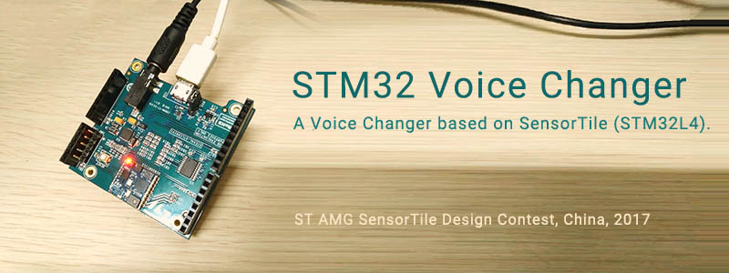

## STM32 Voice Changer



A **Real-time** Voice Changer based on SensorTile (STM32L4).

此为 ST AMG SensorTile 开发大赛参赛作品。

## Build

1. Download and uncompress [STSW-STLKT01 1.2.0](http://www.st.com/zh/embedded-software/stsw-stlkt01.html)
2. Move this project into `v1.2.0\Projects\SensorTile\Applications\`
3. Open `MDK-ARM\Project.uvprojx` with Keil uVision 5.
4. Install missing packs.
5. Build

## Usage

### Hardware

- SensorTile board
- Earphone or Speaker with 3.5mm Jack

### Controlling

1. Connect the speaker to SensorTile.
2. Speak to the on-board microphone (the green component).
3. Tilt left/right to change the equalizer.
4. Flip forward/backward to change the pitch.

### Notice

The microphone is fragile without a shield or any protector. Do NOT spit on it. You shall cover it with a piece of sponge, and keep distance while speaking.

麦克风很脆弱，注意避免唾沫飞到上面。说话时保持距离。如果有条件可贴一层海绵~~，或者手纸~~。


## LICENSE

Codes under `vox` folder are licensed under [Apache License 2.0](http://www.apache.org/licenses/LICENSE-2.0)

```
Copyright 2017 laobubu

Licensed under the Apache License, Version 2.0 (the "License");
you may not use this file except in compliance with the License.
You may obtain a copy of the License at

    http://www.apache.org/licenses/LICENSE-2.0

Unless required by applicable law or agreed to in writing, software
distributed under the License is distributed on an "AS IS" BASIS,
WITHOUT WARRANTIES OR CONDITIONS OF ANY KIND, either express or implied.
See the License for the specific language governing permissions and
limitations under the License.
```